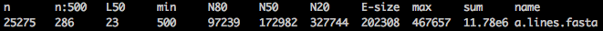
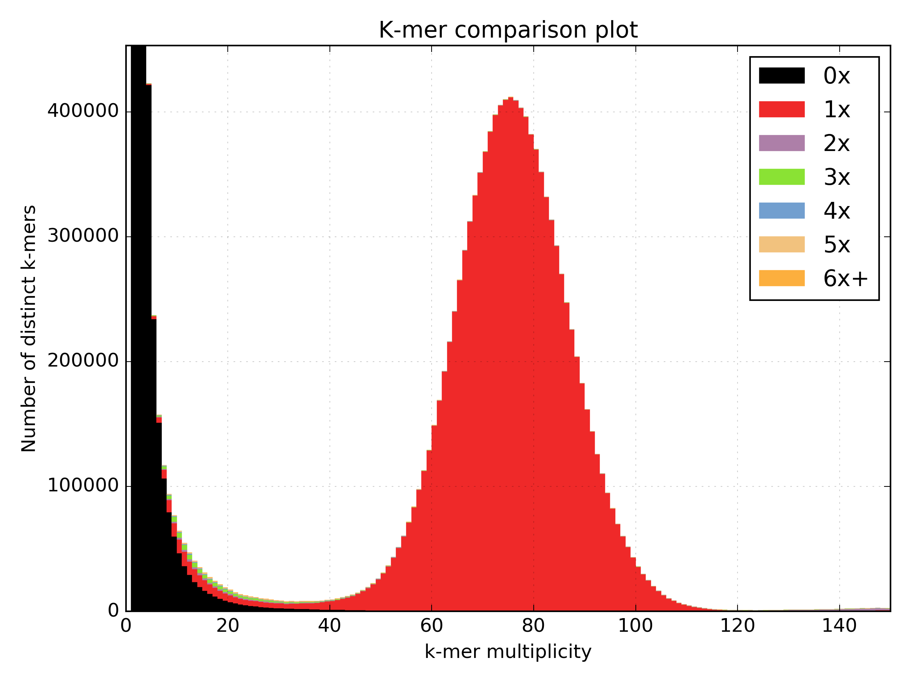

# w2rap
WGS (Wheat) Robust Assembly Pipeline

## Software required
To run the pipeline you will need to install the following;  

* [KAT] (https://github.com/TGAC/KAT)  
* [BWA] (https://sourceforge.net/projects/bio-bwa/files/) (or other short-read aligner)  
* [FLASh] (https://ccb.jhu.edu/software/FLASH/)  
* [FASTX toolkit] (http://hannonlab.cshl.edu/fastx_toolkit/)  
* [Nextclip] (https://github.com/richardmleggett/nextclip/)  
* Something to calculate assembly stats (eg. [abyss-fac] (http://www.bcgsc.ca/platform/bioinfo/software/abyss))

Other tools are optional depending on how much QC and validation you want to perform on your reads and assembly.  We recommend;  

* [FastQC] (http://www.bioinformatics.babraham.ac.uk/projects/fastqc/)  
* [BUSCO] (http://busco.ezlab.org/)
* [QUAST] (http://quast.sourceforge.net/quast)

## w2rap steps using Saccharomyces cerevisiae dataset
### 1) QC PE read files
a) Run FASTQC to check read qualities etc.

```
mkdir fastqc
fastqc -o fastqc scer_R1.fastq scer_R2.fastq
```
FastQC generates an HTML report in the fastqc directory showing various read quality metrics.  You should calculate the read coverage using the read count; 

FastQC shows we have 3,648,316 PE reads (read length 300bp) so we have 3,648,316 * 100 * 2 = 729,663,200 bp coverage   
The [S. cerevisiae genome] (http://www.biology-pages.info/G/GenomeSizes.html) is ~12.5 Mb which means we have 729,663,200 / 12,495,682 = 58.4x genome coverage
 
b) Use KAT hist to generate a kmer histogram to estimate kmer coverage

```
kat hist -o scer_pe_hist -h 80 -t 8 -m 27 -H 100000000 scer_R?.fastq
```
![] (images/scer_pe_hist.png)

c) Use KAT comp to create a density plot comparing read 1 and read 2

```
kat comp -o scer_pe_R1vsR2 -n -t 8 -m 27 -H 100000000 -I 100000000 scer_R1.fastq scer_R2.fastq
```
![] (images/scer_pe_R1vsR2-main.mx.density.png =200x200)


d)  Download the S. cerevisiae [reference] (http://downloads.yeastgenome.org/sequence/S288C_reference/genome_releases/), map reads and generate a SAM file. 

```
bwa index -p scer_ref -a bwtsw ref/S288C_reference_sequence_R64-2-1_20150113.fsa
bwa mem -SP -t 8 scer_ref scer_R?.fastq > pe2ref.sam
```

e) Generate an insert size histogram to check the insert size and shape of the distribution.

```
grep -v ‘@SQ' pe2ref.sam | grep -v '@PG' | awk -v binsize=20 '{if ($5>40) {if ($9>0) {print int($9/binsize)}else{print int($9/binsize*-1)}}}' | sort -n | uniq -c | awk -v binsize=20 '{print $2*binsize","$1}' > pe2ref.is
```


### 2) Contigging
Use the w2rap-contigger to generate contigs from the PE reads.

```
mkdir contigs
w2rap-contigger/bin/w2rap-contigger -t 16 -m 200 -r scer_R1_san.fastq,scer_R2_san.fastq -o contigs -p scer_k200 -K 200
```
The contigs FASTA is generated in contigs/a.lines.fasta 

### 3) Contig assessment
a) Check N50, total content etc.

```
abyss-fac contigs/a.lines.fasta
```


b) Use KAT comp to generate a spectra-cn to compare PE reads to contigs

```
kat comp -o scer_pe_v2_ctgs -t 8 -m 27 -H 100000000 -I 100000000 'scer_R?.fastq' contigs/a.lines.fasta
```



c) Align genes, QUAST, BUSCO etc.

### 4) LMP processing
Run FastQC to check read qualities etc.

Run Python script to remove Nextera adapters from LMP reads and any PE contamination.  

```  
lmp_processing <read_file_list> <ncpus>  
```

read\_file\_list: a text file containing a list of LMP FASTQ files to process.  Files must be uncompressed and end in \_R1.fastq or \_R2.fastq.  
eg.  

```  
/path/to/LIB1_R1.fastq  
/path/to/LIB1_R2.fastq  
/path/to/LIB2_R1.fastq  
/path/to/LIB2_R2.fastq  
```

ncpus: the number of CPUs to use.

Processed LMP files will be written to the 'nextclip' directory. Read counts before and after trimming are written to the log file.

### 5) QC processed LMPs
a) Calculate fragment coverage from trimmed read count  
b) Use KAT comp to check for LMP representation issues by comparing LMP reads to PE reads to check for LMP representation issues 

```
kat comp -t 16 -m 37 -n -H10000000000 -I10000000000 -o lmp_vs_pe '/path/to/trimmed_lmp_R1.fastq /path/to/trimmed_lmp_R2.fastq' '/path/to/pe_R1.fastq /path/to/pe_R2.fastq'
```

c) Map the reads to a reference and generate an insert size histogram to check the insert size and the shape of the distribution

```
bwa index -p yeast ./contigs/a.lines.fasta
bwa mem -SP -t 8 yeast /path/to/trimmed_lmp_R1.fastq /path/to/trimmed_lmp_R2.fastq > lmp2ref.sam

bioawk -c'sam' '{if ($mapq>=60){if($tlen<0){print int($tlen/100)*100}else{print -int($tlen/100)*100}}}' lmp2ref.sam  | sort -n | uniq -c | awk '{print $2","$1}' > lmp_insert_sizes.txt

```

### 6) Scaffolding
a) Make a [SOAPdenovo config file] (http://soap.genomics.org.cn/soapdenovo.html) using both the PE and LMP reads to scaffold. 

```
[LIB]
avg_ins=320
q1=/path/to/pe_R1.fastq
q2=/path/to/pe_R2.fastq

[LIB]
avg_ins=12300
reverse_seq=1
q1=/path/to/trimmed_lmp__R1.fastq
q2=/path/totrimmed_lmp__R2.fastq
```
 
b) Run "prepare->map->scaff" pipeline.  

```
./finalFusion -t 8 -g yeast -D -K 71 -c ./contigs/a.lines.fasta

FLAGS=""
PREFIX="yeast"
CONFIG_FILE="./soap.config"
NCPUS="32"

/path/to/SOAPdenovo-127mer map $FLAGS 71 -s $CONFIG_FILE -p $NCPUS -g $PREFIX >>$PREFIX.map.log 2>&1


/path/to/SOAPdenovo-127mer scaff -p $NCPUS -g $PREFIX >>$PREFIX.scaff.log 2>&1
```

c) SOAPdenovo converts gaps in contigs to Cs and Gs so we need to convert these back to Ns.

```
python SOAP_n_remapper.py <contigPosInScaff_file> <scafSeq_file> <contig_file> <output_file>
```

### 7) Scaffold validation
a) Check N50, total content, gaps etc.  

```
```

b) Use KAT comp to generate a spectra-cn to compare PE reads to scaffolds  

```
```

c) Align genes, QUAST, BUSCO etc.

```
python /path/to/busco2/BUSCO.py -o busco_lmp -in ./yeast_ns_remapped.fasta -l ~/busco_data/eukaryota -m genome -f

mkdir quast
python /path/to/quast/quast.py -o ./quast -R ./yeast.scafSeq -t 8 -f ref/S288C_reference_sequence_R64-2-1_20150113.fsa
```


### 8) Generate release
a) Check for contamination  
b) Remove phiX and Illumina adapters
