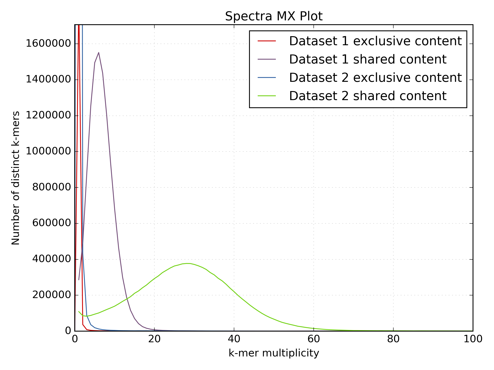

# W2rap: the WGS (Wheat) Robust Assembly Pipeline 
This is a short tutorial on how to use w2rap to get from raw data to scaffolds. We have provided a test *Saccharomyces cerevisiae* dataset consisting of one paired-end library and two long mate-pair libraries.

 * LIB4432\_R1.fastq, LIB4432\_R2.fastq - PE read files
 * LIB6470\_R1.fastq, LIB6470\_R2.fastq - LMP read files from library 1
 * LIB6471\_R1.fastq, LIB6471\_R2.fastq - LMP read files from library 2

We also provide the *Saccharomyces cerevisiae* reference sequence for QC purposes which can also be downloaded from the [Saccharomyces Genome Database] (http://downloads.yeastgenome.org/sequence/S288C_reference/genome_releases/).

## Software required
To run the pipeline you will need to install the following;  

* [K-mer Analysis Toolkit (KAT)] (https://github.com/TGAC/KAT)  
* [BWA] (https://sourceforge.net/projects/bio-bwa/files/) (or other short-read aligner)  
* [FLASh] (https://ccb.jhu.edu/software/FLASH/)  
* [FASTX toolkit] (http://hannonlab.cshl.edu/fastx_toolkit/)  
* [Nextclip] (https://github.com/richardmleggett/nextclip/)  
* Something to calculate assembly stats (eg. [abyss-fac] (http://www.bcgsc.ca/platform/bioinfo/software/abyss))
* [Python] (https://www.python.org/downloads/release/python-2711/) with Biopython and Matplotlib installed

Other tools are optional depending on how much QC and validation you want to perform on your reads and assembly.  We recommend;  

* [FastQC] (http://www.bioinformatics.babraham.ac.uk/projects/fastqc/)  
* [BUSCO] (http://busco.ezlab.org/)
* [QUAST] (http://quast.sourceforge.net/quast)

This tutorial assumes that you are using a Linux machine. If you do not have access to a Linux machine, you will need to find equivalent tools which run on your operating system to complete some of the steps.

## Step 1: QC PE read files
### a) Run FASTQC to check read metrics.

```
mkdir fastqc
fastqc -o fastqc LIB4432_R1.fastq LIB4432_R2.fastq
```
[FastQC] (http://www.bioinformatics.babraham.ac.uk/projects/fastqc/)  generates an HTML report in the fastqc directory. The report will give some indications about the quality of your reads, and the success of your sequencing run. Consult the documentation on the website, and the example reports from good and bad Illumina runs for further information. You should calculate the read coverage using the read count. 

![] (images/fastqc.png)

FastQC shows we have 1,641,301 PE reads of length 151bp providing 1,641,301 * 151 * 2 = 495,672,902 bp coverage   
The [S. cerevisiae genome] (http://www.biology-pages.info/G/GenomeSizes.html) is ~12.5 Mb which means we have 495,672,902 / 12,495,682 = **39.7x genome coverage**
 
### b) Use KAT hist to estimate kmer coverage. 

```
kat hist -o scer_pe_hist -h 80 -t 8 -m 27 -H 100000000 LIB4432_R?.fastq
```


The histogram shows us how often kmers appear in the PE reads. We can see that at frequency < 5, the number of distinct kmers increases significantly, these kmers are from erroneous reads. The kmers we want to assemble are from the main distribution. This is a relatively symmetrical distribution, centered at approximately 30, with a reasonably small variance. Hence, the estimated kmer coverage is equal to 30.  

### c) Check insert size and distribution.
To enable a more detailed assessment of the quality of the reads, map them to the S288C reference seqeunce, and generate a SAM file. 

```
bwa index -p S288C_ref -a bwtsw ref/S288C_reference_sequence_R64-2-1_20150113.fsa
bwa mem -SP -t 8 S288C_ref LIB4432_R?.fastq > pe2ref.sam
```

By checking that a reasonable percentage of your reads map to the reference, you can be confident that your sequencing data is of a reasonable quality. The following command gives a count of reads mapping to the reference:

```
samtools view -F 4  pe2ref.sam | cut -f 1 | sort | uniq | wc -l
```

From the SAM file generated above, we can obtain the raw data needed to draw an insert size histogram (using read pairs mapping with quality 60 only) as follows: 

```
grep -v '@SQ' pe2ref.sam | grep -v '@PG' | awk -v binsize=20 '{if ($5==60) {if ($9>0) {print int($9/binsize)}else{print int($9/binsize*-1)}}}' | sort -n | uniq -c | awk -v binsize=20 '{print $2*binsize","$1}' > pe2ref.is
```

Then use your favourite plotting tool to check the insert size and the shape of the distribution.


We can see that the insert sizes are roughly symmetrically distributed around 250. The distribution is quite wide, so a lot of pairs will have an insert size which varies quite far from the average, but we should be able to obtain a reasonable assembly from these reads.

## Step 2: Contigging

Use the w2rap-contigger to generate contigs from the PE reads. The current version of the w2rap contigger runs in 8 steps: 


Step # | Description | Outputs
:---|---|---
1 | Read loading | binary-formatted reads
2 | Kmer counting | raw kmer data
3 | Build small k (k=60) graph from reads | small k graph, read paths
4 | Build large K graph from small k graph and reads | large K graph, read paths
5 | Clean large K graph | large K cleaned graph, read paths
6 | Local assemblies on the large K graph "gaps" | large K completed graph, read paths
7 | Graph simplification and PathFinder | large K simplified graph, read paths, raw/contig-lines GFA and fasta
8 | PE-scale scaffolding across gaps in the large K graph | large K simplified graph with jumps, read paths, raw/lines GFA and fasta

By default the contigger will run each of these steps in order, not dumping unnecessary intermediate files. Each step can be run individually, by specifying the `--from_step ` and `--to_step`. If you specify the `--to_step`, the contigger will automatically dump the output files from the specified step. To be able to run from any intermediate step, the preceeding steps must have been run with the `--dump_all` flag set. 

You need to create a new directory for the intermediate and output files. To run from start to finish with default assembly parameters, run: 

```
mkdir contigs
w2rap-contigger/bin/w2rap-contigger -t 16 -m 200 -r LIB4432_R1.fastq,LIB4432_R2.fastq -o contigs -p scer_k200 
```
The contigs FASTA is generated in ```contigs/a.lines.fasta```

The number of times a kmer must appear in the reads to be included in the small k graph can be controlled with the `--min_freq` parameter:

```
w2rap-contigger/bin/w2rap-contigger -t 16 -m 200 -r LIB4432_R1.fastq,LIB4432_R2.fastq -o contigs -p scer_k200 --min_freq 20
```

Ideally, `--min_freq` should be selected to remove erronous kmers, and retain most kmers which are genuinely present in the genome of interest. This value can be determined with the help of the kmer histogram from the kmer spectra generated in Step 1 b). 

In the above examples we use the default kmer length of 200 but you may want to generate assemblies using different kmer lengths and assess each one. We can vary the value of k used to build the large k graph with the `-K` option, like so:

```
w2rap-contigger/bin/w2rap-contigger -t 16 -m 200 -r LIB4432_R1.fastq,LIB4432_R2.fastq -o contigs -p scer_k200 -K 220 --from_step 3
```

More detail about these options, and descriptions of the other options, can be found in the full w2rap paper, or by running the contigger with the `--help` parameter:

## Step 3: Contig assessment
### a) Check assembly contiguity.

```
abyss-fac contigs/a.lines.fasta
```


We are assembling 11.54 Mb of the 12 Mb *S. cerevisiae*  genome into 1723 contigs longer than 500bp and the contig-N50 is 10.2 Kb. The expected number of contigs and N50 will vary significantly between genomes, in particular more complex and repetitive genomes may be more fragmented and hence have a lower N50. 

### b) Compare PE reads to contigs.
Use KAT comp to compare kmer content of PE reads to kmer content of the contigs using a spectra-cn plot. You expect to see all the content from the reads represented in the contigs and no new content (which could represent missassemblies). See the [KAT documentation](https://kat.readthedocs.io/en/latest/) for more details on how to interpret KAT plots. 

```
kat comp -o scer_pe_v2_ctgs -t 8 -m 27 -H 100000000 -I 100000000 'LIB4432_R?.fastq' contigs/a.lines.fasta
```


This spectra shows we are assembling almost all the content from the reads correctly with no evidence of missassembly.  There is some evidence of reads from the error distribution appearing in the assembly.

### c) Assess assembly accuracy using QUAST.

```
mkdir quast
python /path/to/quast.py -o ./quast -R ref/S288C_reference_sequence_R64-2-1_20150113.fsa -t 8 -f ../tutorial_runthrough/contigs/a.lines.fasta
```
When a reference is provided, QUAST generates a report containing useful statistics including an estimation of missassemblies:

Genome statistic	 | a.lines
-------------------- |---------------
Genome fraction (%)			  |	91.919
Duplication ratio			  |	1.033
Largest alignment			  |	47316
Total aligned length		  |	11535940
NGA50							  |	9669
LGA50							  |	381
Misassemblies					  |28
Misassembled contigs		  |28
Misassembled contigs length  |	826088
Mismatches per 100 kbp		  |3.19
indels per 100 kbp			  |1.56
N's per 100 kbp				  |	55.41
contigs						  | 	1723
Largest contig				  |	76827
Total length					  |	11785235
Total length (>= 1000 bp)	  | 11480625
Total length (>= 10000 bp)	  | 5930056
Total length (>= 50000 bp)	  | 282022


### d) Assess assembly completeness by aligning BUSCO genes.

Run BUSCO like so:

```
python /path/to/busco2/BUSCO.py -o busco_pe -in contigs/a.line.fasta -l ~/busco_data/eukaryota -m genome -f
```

The proportion of BUSCOs present is assumed to be similar to the proportion of all genes present, so the summary table enables us to estimate how well the assembly captures the genetic content of the genome:

	Count		|       Type    
------------ | -----------------------------------
        407  |   Complete BUSCOs
        379  |   Complete and single-copy BUSCOs
        28  |   Complete and duplicated BUSCOs
        13    |   Fragmented BUSCOs
        9    |   Missing BUSCOs
        429  |   Total BUSCO groups searched


## Step 4: LMP processing
There are two LMP libraries. To avoid repetition, we have taken some of these steps for one library only, but they should be performed with both.
 
### a) Run FastQC to check read metrics
This is run for LMP reads in the same way as for PE reads.

### b) Identify good LMP reads.
A Python script is provided to remove Nextera adapters from LMP reads and any PE contamination. Run it as follows;  

```  
lmp_processing <read_file_list> <ncpus>  
```

read\_file\_list: a text file containing a list of LMP FASTQ files to process.  Files must be uncompressed and end in \_R1.fastq or \_R2.fastq.  
eg.  

```  
/path/to/LIB1_R1.fastq  
/path/to/LIB1_R2.fastq  
/path/to/LIB2_R1.fastq  
/path/to/LIB2_R2.fastq  
```

ncpus: the number of CPUs to use.

The processed LMP FASTQ files will be written to the `nextclip` directory. These files should be used in the subsequent scaffolding step. The read counts before and after trimming are written to the log file, for the test dataset we get the following;

```
LIB6470 read count before trimming: 576252
LIB6471 read count before trimming: 576252

LIB6470 read count after trimming: 435974
LIB6471 read count after trimming: 443411
```

## Step 5: QC processed LMPs 
### a) Use KAT comp to check for LMP representation issues.
KAT comp can also be used to generate a spectra-mx plot which shows kmers that are shared between two datasets and kmers exclusive to each dataset. As PE and LMP reads originate from the same sample, there should be no content in the LMP data which is not present in the PE data, and vice versa. Hence, content should be shared and there should be no exclusive content.

First generate the using KAT comp;

```
kat comp -n -t 16 -m 27 -H10000000000 -I10000000000 -o lmp_vs_pe '/path/to/trimmed_lmp_R1_lib1.fastq /path/to/trimmed_lmp_R2_lib1.fastq' '/path/to/pe_R1.fastq /path/to/pe_R2.fastq'
```
Then plot the spectra-mx;
```
kat plot spectra-mx -o lmp_vs_pe_spectra_mx.png -x 100 --intersection lmp_vs_pe-main.mx
```



This shows that the majority of content is shared between PE and LMP reads.

### b) Check the LMP insert size distribution
Map the reads to the reference (or the contigs generated in step 2) and generate an insert size histogram to check the insert size and the shape of the distribution. 

```
bwa index -p yeast ./contigs/a.lines.fasta
bwa mem -SP -t 8 yeast /path/to/trimmed_lmp_R1_lib1.fastq /path/to/trimmed_lmp_R2_lib1.fastq > lmp2contig.sam

grep -v '@SQ' lmp1ref.sam | grep -v '@PG' | awk -v binsize=100 '{if ($5==60) {if ($9<0) {print int($9/binsize)}else{print int($9/binsize*-1)}}}' | sort -n | uniq -c | awk -v binsize=100 '{print $2*binsize","$1}' > lmp1ref.is

# old bit
bioawk -c'sam' '{if ($mapq>=60){if($tlen<0){print int($tlen/100)*100}else{print -int($tlen/100)*100}}}' lmp2ref.sam  | sort -n | uniq -c | awk '{print $2","$1}' > lmp_insert_sizes.txt

```

This is the expected distribution of the insert sizes of library 1: 


The distribution has a clear, pronounced peak so it is easy to see that the insert size is approximately 5000. There is no paired end contamination present, as this would cause another peak closer to the origin.  

### c) Calculate the read and fragment coverage.
From trimmed read count and insert size

TODO

## Step 6: Scaffolding

s\_prepare, s\_map and s\_scaff are modified versions of the prepare, map and scaff stages of the SOAPdenovo pipeline which are more configurable and thus better suited to complex genomes.

### a) Make a [SOAPdenovo config file] (http://soap.genomics.org.cn/soapdenovo.html).
It is important to use both the PE and LMP reads to scaffold. 

```
[LIB]
avg_ins=320
q1=/path/to/pe_R1.fastq
q2=/path/to/pe_R2.fastq

[LIB]
avg_ins=5000
reverse_seq=1
q1=/path/to/trimmed_lmp_R1_lib1.fastq
q2=/path/totrimmed_lmp_R2_lib1.fastq

[LIB]
avg_ins=9000
reverse_seq=1
q1=/path/to/trimmed_lmp_R1_lib2.fastq
q2=/path/to/trimmed_lmp_R2_lib2.fastq

```
 
### b) Run the "prepare -> map -> scaff" pipeline.  
s\_prepare converts your contig assembly into a format ready for SOAPdenovo scaffolding. For the majority of use cases, it is suitable to use a kmer length of 71. s\_map maps the reads from all libraries to the contigs. In this stage, the kmer length must be lower as reads may have been trimmed, and a lower value enables reads containing a small number of errors to be mapped to the contigs.  Using multiple CPUs will speed this stage up. s\_scaff generates scaffolds using the mapping results.

```
s_prepare -g yeast -K 71 -c /contigs/a.lines.fasta 2>&1
s_map -k 31 -s soap.config -p 32 -g yeast > yeast.map.log 2>&1
s_scaff -p 8 -g yeast > yeast.scaff.log 2>&1
```

If this pipeline runs successfully, a number of output files will be created. The final scaffolds have the extension `scafSeq`.

### c) Recover gaps
SOAPdenovo converts gaps in contigs to Cs and Gs so we need to convert these back to Ns using the script included. The three input files required are generated by SOAPdenovo.

```
python SOAP_n_remapper.py <contigPosInScaff_file> <scafSeq_file> <contig_file> <output_file>
```

## Step 7: Scaffold validation
### a) Check assembly contiguity.

```
abyss-fac scaffolds/a.lines.fasta
```


The total content is similar to the expected genome size, so the assembly contains roughly the right amount of information. The N50 is reasonable for a genome of this size and complexity.

### b) Compare PE reads to scaffolds  
Use KAT comp to compare kmer content of PE reads to kmer content of the scaffolds using a spectra-cn plot. You expect to see all the content from the reads represented in the scaffolds and no new content (which could represent missassemblies). See the [KAT documentation](https://kat.readthedocs.io/en/latest/) for more details on how to interpret KAT plots. 

```
kat comp -t 16 -m 31 -H10000000000 -I10000000000 -o reads_vs_scaffolds '/path/to/pe_R1.fastq /path/to/pe_R2.fastq' /path/to/scaffolds/yeast.scafSeq
```


Again, there is no content from the reads missing in the assembly and no duplication of content, but there are a few erroneos kmers present.

### c) Assess assembly accuracy using QUAST. 

```
mkdir quast
python /path/to/quast/quast.py -o ./quast -R ./yeast.scafSeq -t 8 -f ref/S288C_reference_sequence_R64-2-1_20150113.fsa
```
As the N50 of the contigs was greater than the average size of a gene, scaffolding did not increase the number of BUSCOs present. 

Genome statistics	 | yeast.scafSeq
-------------------- |---------------
Genome fraction (%)			  |	96.159
Duplication ratio			  |	1.051
Largest alignment			  |	487548
Total aligned length		  |	11726512
NGA50							  |	164971
LGA50							  |	23
Misassemblies					  |
misassemblies					  |95
Misassembled contigs length  |	11382276
Mismatches					  |
mismatches per 100 kbp		  |83.22
indels per 100 kbp			  |9.27
N's per 100 kbp				  |	4258.81
Statistics without reference |	
contigs						  | 	210
Largest contig				  |	1090329
Total length					  |	12303836
Total length (>= 1000 bp)	  | 12216807
Total length (>= 10000 bp)	  | 12128016
Total length (>= 50000 bp)	  | 11941412
Predicted genes	            |
predicted genes (unique)    |	7333

### d) Check assembly completeness by aligning BUSCO genes.
```
python /path/to/busco2/BUSCO.py -o busco_lmp -in ./yeast_ns_remapped.fasta -l ~/busco_data/eukaryota -m genome -f
```
   Count      |       Type
------------- | ------------------------------------
        417   |   Complete BUSCOs
        301   |   Complete and single-copy BUSCOs
        116   |   Complete and duplicated BUSCOs
        6     |   Fragmented BUSCOs
        6     |   Missing BUSCOs
        429   |   Total BUSCO groups searched

We can see that the genome statistics have not changed significantly between the contigging and the scaffolding stage. 

## Step 8: Create release FASTA
At this point you should check for contamination in scaffolds (phiX etc.) and Illumina adapters. If you want to remove seqeunces shorter than a certain threshold (eg. below 500 bp) you can use KAT comp to check whether this removes significant content from the assembly in the same way as step 7 b).
