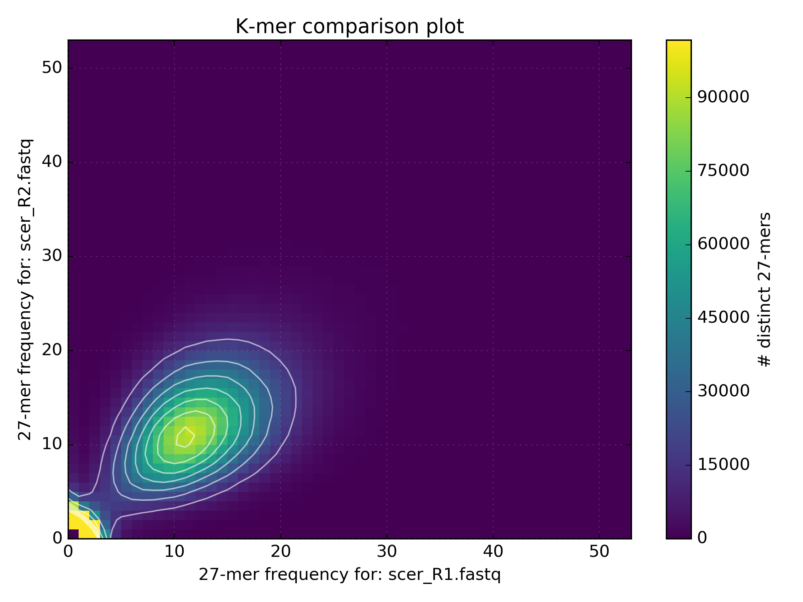
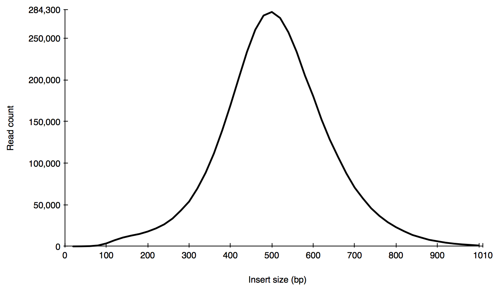
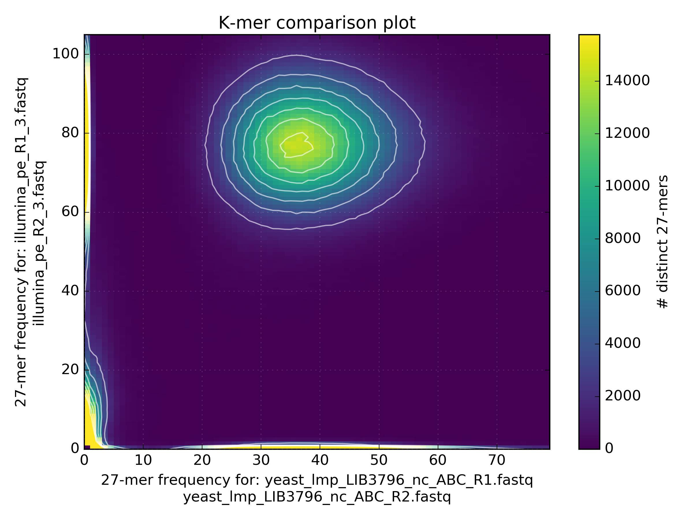

# w2rap
WGS (Wheat) Robust Assembly Pipeline

## Software required
To run the pipeline you will need to install the following;  

* [KAT] (https://github.com/TGAC/KAT)  
* [BWA] (https://sourceforge.net/projects/bio-bwa/files/) (or other short-read aligner)  
* [FLASh] (https://ccb.jhu.edu/software/FLASH/)  
* [FASTX toolkit] (http://hannonlab.cshl.edu/fastx_toolkit/)  
* [Nextclip] (https://github.com/richardmleggett/nextclip/)  
* Something to calculate assembly stats (eg. [abyss-fac] (http://www.bcgsc.ca/platform/bioinfo/software/abyss))
* [bioawk](https://github.com/lh3/bioawk)
* Python with Biopython and Matplotlib installed [python2] (https://www.python.org/downloads/release/python-2711/)

Other tools are optional depending on how much QC and validation you want to perform on your reads and assembly.  We recommend;  

* [FastQC] (http://www.bioinformatics.babraham.ac.uk/projects/fastqc/)  
* [BUSCO] (http://busco.ezlab.org/)
* [QUAST] (http://quast.sourceforge.net/quast)

## w2rap steps using Saccharomyces cerevisiae dataset
### 1) QC PE read files
a) Run FASTQC to check read metrics.

```
mkdir fastqc
fastqc -o fastqc scer_pe_R1.fastq scer_pe_R2.fastq
```
FastQC generates an HTML report in the fastqc directory.  You should calculate the read coverage using the read count. 

![] (images/fastqc.png)

FastQC shows we have 2,519,142 PE reads of length 300bp providing 2,519,142 * 300 * 2 = 1,511,485,200 bp coverage   
The [S. cerevisiae genome] (http://www.biology-pages.info/G/GenomeSizes.html) is ~12.5 Mb which means we have 1,511,485,200 / 12,495,682 = 121x genome coverage
 
b) Use KAT hist to generate a kmer histogram to estimate kmer coverage. The histogram shows us how often kmers appear in reads 1 and 2, 

```
kat hist -o scer_pe_hist -h 80 -t 8 -m 27 -H 100000000 scer_pe_R?.fastq
```


We can see that as the frequency approaches zero, the number of distinct kmers increases significantly, these kmers are from erroneous reads. There is a relatively symmetrical distribution, centered at approximately 80, with a reasonably small variance. Hence, the estimated kmer coverage is equal to 80.  

c) Use KAT comp to create a density plot comparing read 1 and read 2. 

```
kat comp -o scer_pe_R1vsR2 -n -t 8 -m 27 -H 100000000 -I 100000000 scer_pe_R1.fastq scer_pe_R2.fastq
```


This allows us to compare kmer representations from each read set. These should be roughly equal, and in this case they are, as indicated by the yellow peak towards the center.

d)  To enable a more detailed assessment of the quality of the reads, download the S. cerevisiae [reference] (http://downloads.yeastgenome.org/sequence/S288C_reference/genome_releases/), map the reads to it, and generate a SAM file. 

```
bwa index -p scer_ref -a bwtsw ref/S288C_reference_sequence_R64-2-1_20150113.fsa
bwa mem -SP -t 8 scer_ref scer_pe_R?.fastq > pe2ref.sam
```

e) From the SAM file generated above, we can obtain an insert size histogram to check the insert size and the shape of the distribution.

```
grep -v ‘@SQ' pe2ref.sam | grep -v '@PG' | awk -v binsize=20 '{if ($5>40) {if ($9>0) {print int($9/binsize)}else{print int($9/binsize*-1)}}}' | sort -n | uniq -c | awk -v binsize=20 '{print $2*binsize","$1}' > pe2ref.is
```


We can se that the insert sizes are roughly symmetrically distributed around 500. The distribution is quite wide, so a lot of pairs will have an insert size which varies quite far from the average, but we should be able to obtain a reasonable assembly from these reads.


### 2) Contigging

Use the w2rap-contigger to generate contigs from the PE reads. The current version of the w2rap contigger runs in 7 steps: 


Step # | Description | Outputs
:---|---|---
1 | Read loading | binary-formatted reads
2 | Build small k (k=60) graph from reads | small k graph, read paths
3 | Build large K graph from small k graph and reads | large K graph, read paths
4 | Clean large K graph | large K cleaned graph, read paths
5 | Local assemblies on the large K graph "gaps" | large K completed graph, read paths
6 | Graph simplification and PathFinder | large K simplified graph, read paths, raw/contig-lines GFA and fasta
7 | PE-scale scaffolding across gaps in the large K graph | large K simplified graph with jumps, read paths, raw/lines GFA and fasta

By default the contigger will run each of these steps in order, not dumping unnecessary intermediate files. Each step can be run individually, by specifying the `--from_step ` and `--to_step`. If you specify the `--to_step`, the contigger will automatically dump the output files from the specified step. To be able to run from any intermediate step, the preceeding steps must have been run with the `--dump_all` flag set. 

You need to create a new directory for the intermediate and output files. To run from start to finish with default assembly parameters, run: 

```
mkdir contigs
w2rap-contigger/bin/w2rap-contigger -t 16 -m 200 -r scer_pe_R1.fastq,scer_pe_R2.fastq -o contigs -p scer_k200 
```
The contigs FASTA is generated in contigs/a.lines.fasta 


The number of times a kmer must appear in the reads to be included in the small k graph can be controlled with the `--min_freq` parameter:

```
w2rap-contigger/bin/w2rap-contigger -t 16 -m 200 -r scer_pe_R1.fastq,scer_pe_R2.fastq -o contigs -p scer_k200 --min_freq 20
```

Ideally, `--min_freq` should be selected to remove most error kmers, and retain most kmers which are genuinely present in the genome of interest. This value can be determined with the help of the kmer histogram from step b) of the QC. 

In the above examples we use the default kmer length of 200 but you may want to generate assemblies using different kmer lengths and assess each one. We can vary the value of k used to build the large k graph with the `-K` option, like so:

```
w2rap-contigger/bin/w2rap-contigger -t 16 -m 200 -r scer_pe_R1.fastq,scer_pe_R2.fastq -o contigs -p scer_k200 -K 220 --from_step 3
```

More detail about these options, and descriptions of the other options, can be found in the full w2rap paper. 

### 3) Contig assessment
a) Check contiguity stats.

```
abyss-fac contigs/a.lines.fasta
```


We are assembling ~95% of the genome in contigs longer than 500bp.  The contig-N50 is 173 Kb. 

b) Use KAT comp to generate a spectra-cn to compare PE reads to contigs

```
kat comp -o scer_pe_v2_ctgs -t 8 -m 27 -H 100000000 -I 100000000 'scer_pe_R?.fastq' contigs/a.lines.fasta
```


This spectra shows we are assembling almost all the content from the reads correctly with no evidence of missassembly.  There is some evidence of reads from the error distribution appearing in the assembly (see the [KAT documentation](https://kat.readthedocs.io/en/latest/) for more details on how to interpret KAT plots).

c) Assess assembly accuracy and completeness using QUAST and aligning BUSCO genes.

```
mkdir quast
python /path/to/quast.py -o ./quast -R ref/S288C_reference_sequence_R64-2-1_20150113.fsa -t 8 -f ../tutorial_runthrough/contigs/a.lines.fasta
```
When a reference is provided, QUAST generates a report containing useful statistics including an estimation of missassemblies:


Genome statistics	 | a.lines
-------------------- |---------------
Genome fraction (%)			  |	96.159
Duplication ratio			  |	1.006
Largest alignment			  |	466909
Total aligned length		  |	11728906
NGA50							  |	160207
LGA50							  |	25
Misassemblies					  |
misassemblies					  |19
Misassembled contigs length  |	1260681
Mismatches					  |
mismatches per 100 kbp		  |84.02
indels per 100 kbp			  |9.61
N's per 100 kbp				  |	14.42
Statistics without reference |	
contigs						  | 	286
Largest contig				  |	467657
Total length					  |	11785235
Total length (>= 1000 bp)	  | 11696184
Total length (>= 10000 bp)	  | 11544270
Total length (>= 50000 bp)	  | 10792181
Predicted genes	            |
predicted genes (unique)    |	7313

Run BUSCO like so:

```
python /path/to/busco2/BUSCO.py -o busco_pe -in contigs/a.line.fasta -l ~/busco_data/eukaryota -m genome -f
```

The proportion of BUSCOs present is assumed to be similar to the proportion of all genes present, so the summary table enables us to estimate how well the assembly captures the genetic content of the genome:

	Count		|       Type    
------------ | -----------------------------------
        419  |   Complete BUSCOs
        403  |   Complete and single-copy BUSCOs
        16   |   Complete and duplicated BUSCOs
        5    |   Fragmented BUSCOs
        5    |   Missing BUSCOs
        429  |   Total BUSCO groups searched


### 4) LMP processing
a) Run FastQC to check read metrics for LMP as shown above.

b) Run the Python script to remove Nextera adapters from LMP reads and any PE contamination.  

```  
lmp_processing <read_file_list> <ncpus>  
```

read\_file\_list: a text file containing a list of LMP FASTQ files to process.  Files must be uncompressed and end in \_R1.fastq or \_R2.fastq.  
eg.  

```  
/path/to/LIB1_R1.fastq  
/path/to/LIB1_R2.fastq  
/path/to/LIB2_R1.fastq  
/path/to/LIB2_R2.fastq  
```

ncpus: the number of CPUs to use.

The processed LMP files will be written to the 'nextclip' directory. These should be used in the subsequent scaffolding. The read counts before and after trimming are written to the log file, for the test dataset we get the following before and after values:

```
yeast_lmp_LIB3796 read count before trimming: 4094921
yeast_lmp_LIB3797 read count before trimming: 2686352

yeast_lmp_LIB3796 read count after trimming: 2628914
yeast_lmp_LIB3797 read count after trimming: 1673233
```

### 5) QC processed LMPs 
a) Use KAT comp to check for LMP representation issues by comparing LMP reads to PE reads to check for LMP representation issues 

```
kat comp -n -t 16 -m 27 -n -H10000000000 -I10000000000 -o lmp_vs_pe '/path/to/trimmed_lmp_R1_lib1.fastq /path/to/trimmed_lmp_R2_lib1.fastq' '/path/to/pe_R1.fastq /path/to/pe_R2.fastq'
```



b) Map the reads to a reference and generate an insert size histogram to check the insert size and the shape of the distribution. 

```
bwa index -p yeast ./contigs/a.lines.fasta
bwa mem -SP -t 8 yeast /path/to/trimmed_lmp_R1_lib1.fastq /path/to/trimmed_lmp_R2_lib1.fastq > lmp2ref.sam

bioawk -c'sam' '{if ($mapq>=60){if($tlen<0){print int($tlen/100)*100}else{print -int($tlen/100)*100}}}' lmp2ref.sam  | sort -n | uniq -c | awk '{print $2","$1}' > lmp_insert_sizes.txt

```

This is the expected distribution of the insert sizes of library 1: 


The distribution has a clear, pronounced peak so it is easy to see that the insert size is approximately 5000. There is no paired end contamination present, as this would cause another peak closer to the origin.  


c) Calculate the fragment coverage from trimmed read count and insert size

TODO

### 6) Scaffolding
a) Make a [SOAPdenovo config file] (http://soap.genomics.org.cn/soapdenovo.html) using both the PE and LMP reads to scaffold. 

```
[LIB]
avg_ins=320
q1=/path/to/pe_R1.fastq
q2=/path/to/pe_R2.fastq

[LIB]
avg_ins=5000
reverse_seq=1
q1=/path/to/trimmed_lmp_R1_lib1.fastq
q2=/path/totrimmed_lmp_R2_lib1.fastq

[LIB]
avg_ins=9000
reverse_seq=1
q1=/path/to/trimmed_lmp_R1_lib2.fastq
q2=/path/totrimmed_lmp_R2_lib2.fastq

```
 
b) Run "prepare->map->scaff" pipeline.  


```
ls /path/to/trimmed_lmps*fastq | awk -F'_R' '{print $1}' | awk -F '/' '{print $NF}' | sort | uniq > libs.lst

./finalFusion -t 8 -g yeast -D -K 71 -c ./contigs/a.lines.fasta

FLAGS=""
PREFIX="yeast"
CONFIG_FILE="./soap.config"
NCPUS="32"

/path/to/SOAPdenovo-127mer map $FLAGS 71 -s $CONFIG_FILE -p $NCPUS -g $PREFIX >>$PREFIX.map.log 2>&1


/path/to/SOAPdenovo-127mer scaff -p $NCPUS -g $PREFIX >>$PREFIX.scaff.log 2>&1
```

If this pipeline runs successfully, the output files with the following extensions should be present, and contain data: .Arc, .bubbleInScaff, .ContigIndex, .contigPosInscaff, .gapSeq, .newContigIndex, .peGrads, .preGraphBasic, .scafSeq, .scafStatistics.


c) SOAPdenovo converts gaps in contigs to Cs and Gs so we need to convert these back to Ns using the script included. The three input files are output by SOAP.

```
python SOAP_n_remapper.py <contigPosInScaff_file> <scafSeq_file> <contig_file> <output_file>
```

### 7) Scaffold validation
a) Check N50 and total content.  

* Total content: 11.78e6bp
* N50: 531425bp

The total content is similar to the expected genome size, so the assembly contains roughly the right amount of information. The N50 is reasonable for a genome of this size and complexity.

b) Use KAT comp to generate a spectra-cn to compare PE reads to scaffolds  

```
kat comp -t 16 -m 31 -H10000000000 -I10000000000 -o reads_vs_scaffolds '/path/to/pe_R1.fastq /path/to/pe_R2.fastq' /path/to/scaffolds/yeast.scafSeq
```


Again, there is no content from the reads missing in the assembly and no duplication of content, but there are a few erroneos kmers present.

c) Run QUAST and align sequences to BUSCOs. 

```
python /path/to/busco2/BUSCO.py -o busco_lmp -in ./yeast_ns_remapped.fasta -l ~/busco_data/eukaryota -m genome -f
```
   Count      |       Type
------------- | ------------------------------------
        418   |   Complete BUSCOs
        400   |   Complete and single-copy BUSCOs
        18    |   Complete and duplicated BUSCOs
        6     |   Fragmented BUSCOs
        5     |   Missing BUSCOs
        429   |   Total BUSCO groups searched

```
mkdir quast
python /path/to/quast/quast.py -o ./quast -R ./yeast.scafSeq -t 8 -f ref/S288C_reference_sequence_R64-2-1_20150113.fsa
```
As the N50 of the contigs was greater than the average size of a gene, scaffolding did not increase the number of BUSCOs present. 

Genome statistics	 | yeast.scafSeq
-------------------- |---------------
Genome fraction (%)			  |	96.159
Duplication ratio			  |	1.051
Largest alignment			  |	487548
Total aligned length		  |	11726512
NGA50							  |	164971
LGA50							  |	23
Misassemblies					  |
misassemblies					  |95
Misassembled contigs length  |	11382276
Mismatches					  |
mismatches per 100 kbp		  |83.22
indels per 100 kbp			  |9.27
N's per 100 kbp				  |	4258.81
Statistics without reference |	
contigs						  | 	210
Largest contig				  |	1090329
Total length					  |	12303836
Total length (>= 1000 bp)	  | 12216807
Total length (>= 10000 bp)	  | 12128016
Total length (>= 50000 bp)	  | 11941412
Predicted genes	            |
predicted genes (unique)    |	7333

We can see that the genome statistics have not changed significantly between the contigging and the scaffolding stage. 
