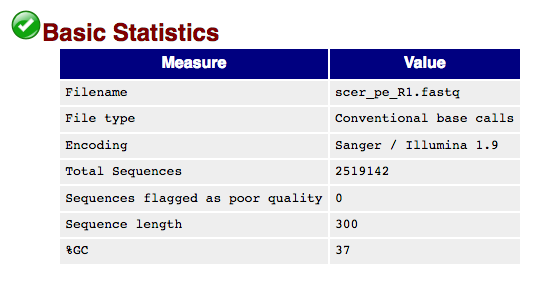
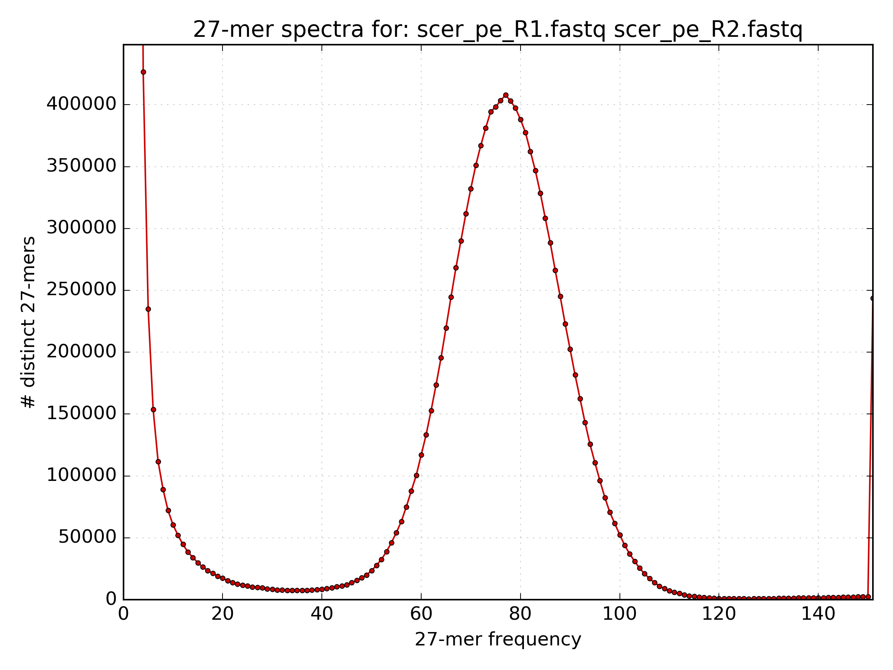
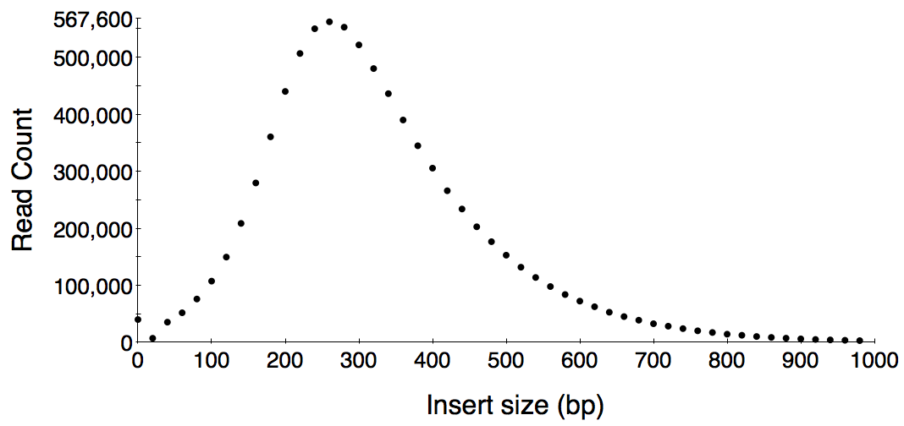
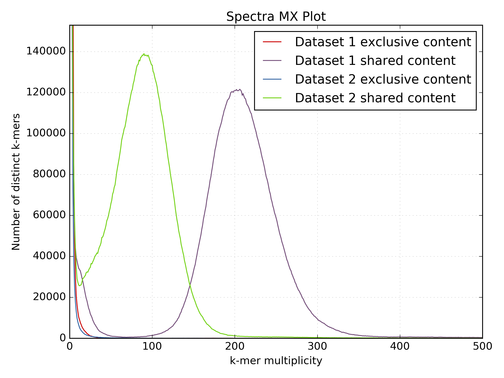
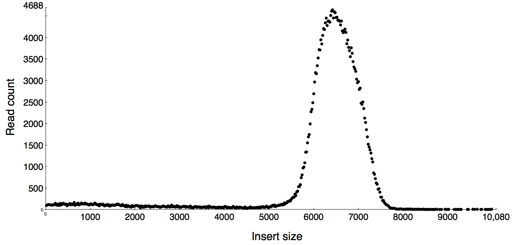
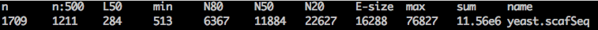
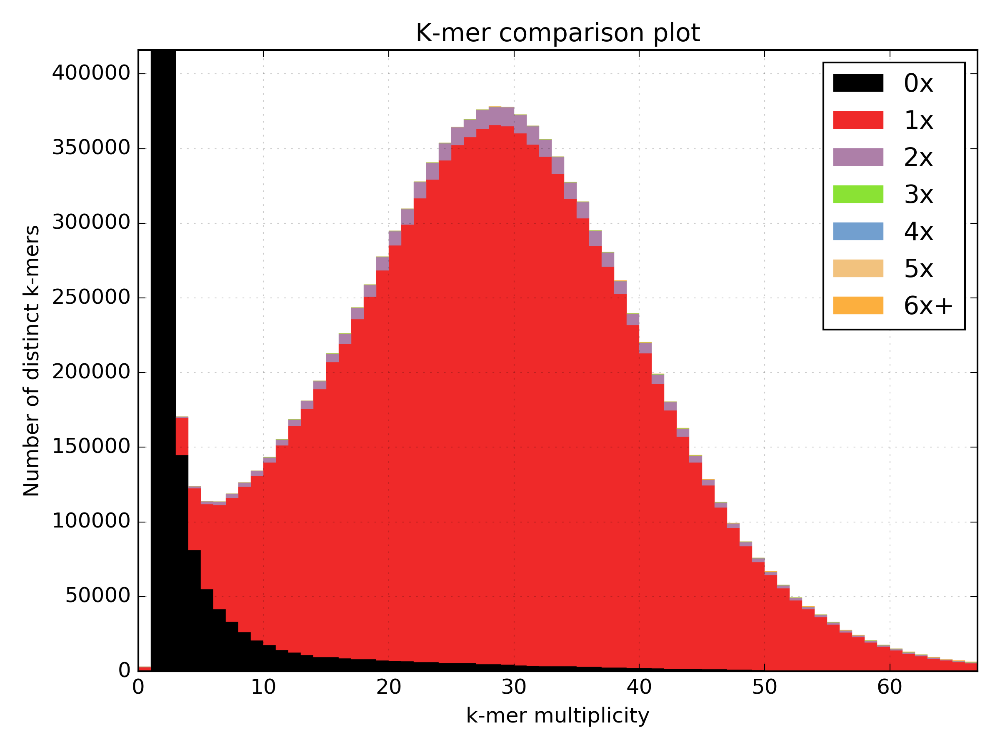

# W2rap: the WGS (Wheat) Robust Assembly Pipeline 
This is a short tutorial on how to use w2rap to generate scaffolds from raw Illumina reads. We have provided a [test dataset](http://opendata.earlham.ac.uk/w2rap/tutorial_files.tar.gz) from *Saccharomyces cerevisiae* consisting of one paired-end (PE) library and one long mate-pair (LMP) library.

 * LIB4432\_R1.fastq, LIB4432\_R2.fastq - PE read files (150 bp read length)
 * LIB6471\_R1.fastq, LIB6471\_R2.fastq - Nextera LMP read files (300 bp read length)

The downloadable dataset also includes the *S. cerevisiae* reference sequence for QC purposes. This was downloaded from the [Saccharomyces Genome Database](http://downloads.yeastgenome.org/sequence/S288C_reference/genome_releases/).

## Software required
To run the pipeline you will need to install the following;  

* [K-mer Analysis Toolkit (KAT)](https://github.com/TGAC/KAT)  
* [w2rap-contigger](https://github.com/bioinfologics/w2rap-contigger)
* [BWA](https://sourceforge.net/projects/bio-bwa/files/) (or other short-read aligner)  
* [FLASh](https://ccb.jhu.edu/software/FLASH/)  
* [Nextclip](https://github.com/richardmleggett/nextclip/)  
* Something to calculate assembly stats (eg. [abyss-fac](http://www.bcgsc.ca/platform/bioinfo/software/abyss))
* [Python v2.7](https://www.python.org/downloads/release/python-2711/) with Biopython and Matplotlib installed

Other tools are optional depending on how much QC and validation you want to perform on your reads and assembly.  We recommend;  

* [FastQC](http://www.bioinformatics.babraham.ac.uk/projects/fastqc/)  
* [BUSCO](http://busco.ezlab.org/)
* [QUAST](http://quast.sourceforge.net/quast)

This tutorial assumes that you are using a Linux machine. If you do not have access to a Linux machine, you will need to find equivalent tools which run on your operating system to complete some of the steps.

The pipeline consists of 8 steps;  
[Step 1: QC PE read files](#step-1-qc-pe-read-files)  
[Step 2: Contigging](#step-2-contigging)  
[Step 3: Contig assessment](#step-3-contig-assessment)  
[Step 4: LMP processing](#step-4-lmp-processing)  
[Step 5: QC processed LMPs](#step-5-qc-processed-lmps)  
[Step 6: Scaffolding](#step-6-scaffolding)  
[Step 7: Scaffold validation](#step-7-scaffold-validation)  
[Step 8: Create release FASTA](#step-8-create-release-fasta)  
  
## Step 1: QC PE read files
[[back to top]](#w2rap-the-wgs-wheat-robust-assembly-pipeline)
### a) Run FASTQC to check read metrics.

```
mkdir fastqc
fastqc -o fastqc LIB4432_R1.fastq LIB4432_R2.fastq
```
[FastQC](http://www.bioinformatics.babraham.ac.uk/projects/fastqc/)  generates an HTML report in the fastqc directory. The report will give some indications about the quality of your reads, and the success of your sequencing run. Consult the documentation on the website, and the example reports from good and bad Illumina runs for further information. You should calculate the read coverage using the read count. 



FastQC shows we have 1,641,301 PE reads of length 151bp providing 1,641,301 * 151 * 2 = 495,672,902 bp coverage   
The [S. cerevisiae genome](http://www.biology-pages.info/G/GenomeSizes.html) is ~12.5 Mb which means we have 495,672,902 / 12,495,682 = **39.7x genome coverage**
 
### b) Use KAT hist to estimate kmer coverage. 

```
kat hist -o scer_pe_hist -h 80 -t 8 -m 27 -H 100000000 LIB4432_R?.fastq
```


The histogram shows us how often kmers appear in the PE reads. We can see that at frequency < 5, the number of distinct kmers increases significantly, these kmers are from erroneous reads. The kmers we want to assemble are from the main distribution. This is a relatively symmetrical distribution, centered at approximately 30, with a reasonably small variance. Hence, the estimated kmer coverage is equal to 30.  

### c) Check insert size and distribution.
To enable a more detailed assessment of the quality of the reads, map them to the S288C reference sequence, and generate a SAM file. 

```
bwa index -p S288C_ref -a bwtsw ref/S288C_reference_sequence_R64-2-1_20150113.fsa
bwa mem -SP -t 8 S288C_ref LIB4432_R?.fastq > pe2ref.sam
```

By checking that a reasonable percentage of your reads map to the reference, you can be confident that your sequencing data is of sufficiently good for the assembly process to proceed smoothly. The following command gives a count of reads mapping to the reference:

```
samtools view -F 4  pe2ref.sam | cut -f 1 | sort | uniq | wc -l
```

From the SAM file generated above, we can obtain the raw data needed to draw an insert size histogram (using read pairs mapping with quality 60 only) as follows: 

```
grep -v '@SQ' pe2ref.sam | grep -v '@PG' | awk -v binsize=20 '{if ($5==60) {if ($9>0) {print int($9/binsize)}else{print int($9/binsize*-1)}}}' | sort -n | uniq -c | awk -v binsize=20 '{print $2*binsize","$1}' > pe2ref.is
```

Then use your favourite plotting tool to check the insert size and the shape of the distribution.



We can see that the insert sizes are roughly symmetrically distributed around 250. The distribution is quite wide, so a lot of pairs will have an insert size which varies quite far from the average, but we should be able to obtain a reasonable assembly from these reads.

## Step 2: Contigging
[[back to top]](#w2rap-the-wgs-wheat-robust-assembly-pipeline)  

Use the [w2rap-contigger](https://github.com/bioinfologics/w2rap-contigger) to generate contigs from the PE reads. The current version runs in 8 steps: 

Step # | Description | Outputs
:---|---|---
1 | Read loading | binary-formatted reads
2 | Kmer counting | raw kmer data
3 | Build small k (k=60) graph from reads | small k graph, read paths
4 | Build large K graph from small k graph and reads | large K graph, read paths
5 | Clean large K graph | large K cleaned graph, read paths
6 | Local assemblies on the large K graph "gaps" | large K completed graph, read paths
7 | Graph simplification and PathFinder | large K simplified graph, read paths, raw/contig-lines GFA and fasta
8 | PE-scale scaffolding across gaps in the large K graph | large K simplified graph with jumps, read paths, raw/lines GFA and fasta

By default the contigger will run each of these steps in order, not dumping unnecessary intermediate files. Each step can be run individually, by specifying the `--from_step ` and `--to_step`. If you specify the `--to_step`, the contigger will automatically dump the output files from the specified step. To be able to run from any intermediate step, the preceeding steps must have been run with the `--dump_all` flag set. 

You need to create a new directory for the intermediate and output files. To run from start to finish using the default assembly parameters, run: 

```
mkdir contigs
w2rap-contigger/bin/w2rap-contigger -t 16 -m 200 -r LIB4432_R1.fastq,LIB4432_R2.fastq -o contigs -p scer_k200 
```
The contigs FASTA is generated in ```contigs/a.lines.fasta```

The number of times a kmer must appear in the reads to be included in the small k graph can be controlled with the `--min_freq` parameter:

```
w2rap-contigger/bin/w2rap-contigger -t 16 -m 200 -r LIB4432_R1.fastq,LIB4432_R2.fastq -o contigs -p scer_k200 --min_freq 20
```

Ideally, `--min_freq` should be selected to remove erronous kmers, and retain most kmers which are genuinely present in the genome of interest. This value can be determined with the help of the kmer histogram from the kmer spectra generated in Step 1 b). 

In the above examples we use the default kmer length of 200 but you may want to generate assemblies using different kmer lengths and assess each one. We can vary the value of k used to build the large k graph with the `-K` option, like so:

```
w2rap-contigger/bin/w2rap-contigger -t 16 -m 200 -r LIB4432_R1.fastq,LIB4432_R2.fastq -o contigs -p scer_k200 -K 220 --from_step 3
```

More detail about these options, and descriptions of the other options, can be found in the [w2rap paper](http://biorxiv.org/content/early/2017/02/22/110999), or by running the contigger with the `--help` parameter:

## Step 3: Contig assessment
[[back to top]](#w2rap-the-wgs-wheat-robust-assembly-pipeline)
### a) Check assembly contiguity.

```
abyss-fac contigs/a.lines.fasta
```


We are assembling 11.54 Mb of the 12 Mb *S. cerevisiae*  genome into 1723 contigs longer than 500bp and the contig-N50 is 10.2 Kb. The expected number of contigs and N50 will vary significantly between genomes, in particular more complex and repetitive genomes may be more fragmented and hence have a lower N50. 

### b) Compare PE reads to contigs.
Use KAT comp to compare the kmer content of the PE reads to the kmer content of the contigs using a spectra-cn plot. You expect to see all the content from the reads represented in the contigs and no new content (which could represent missassemblies). See the [KAT documentation](https://kat.readthedocs.io/en/latest/) for more details on how to interpret KAT plots. 

```
kat comp -o scer_pe_vs_ctgs -t 8 -m 27 -H 100000000 -I 100000000 'LIB4432_R?.fastq' contigs/a.lines.fasta
```


This spectra shows we are assembling almost all the content from the reads correctly with no evidence of missassembly.  There is some evidence of reads from the error distribution appearing in the assembly.

### c) Assess assembly accuracy using QUAST.

```
mkdir quast
python /path/to/quast.py -o ./quast -R ref/S288C_reference_sequence_R64-2-1_20150113.fsa -t 8 -f ../tutorial_runthrough/contigs/a.lines.fasta
```
When a reference is provided, QUAST generates a report containing useful statistics including an estimation of the number of missassemblies:

Genome statistic	 | a.lines
-------------------- |---------------
Genome fraction (%)			  |	91.919
Duplication ratio			  |	1.033
Largest alignment			  |	47316
Total aligned length		  |	11535940
NGA50							  |	9669
LGA50							  |	381
Misassemblies					  |
misassemblies					  |28
Misassembled contigs		  |28
Misassembled contigs length  |	826088
Mismatches						|
Mismatches per 100 kbp		  | 3.19
indels per 100 kbp			  | 1.56
N's per 100 kbp				  |	 55.41
Statistics without reference|
contigs						  | 	1723
Largest contig				  |	844443
Total length					  |	11732078
Total length (>= 1000 bp)	  | 11480625
Total length (>= 10000 bp)	  | 5930056
Total length (>= 50000 bp)	  | 282022
Predicted genes		|
predicted genes (unique)    |	7206


### d) Assess assembly completeness by aligning BUSCO genes.

Run BUSCO like so:

```
python /path/to/busco2/BUSCO.py -o busco_pe -in contigs/a.line.fasta -l ~/busco_data/eukaryota -m genome -f
```

The proportion of BUSCOs present is assumed to be similar to the proportion of all genes present, so the summary table enables us to estimate how well the assembly captures the genetic content of the genome:

Count		|       Type    
------------ | -----------------------------------
407  |   Complete BUSCOs
379  |   Complete and single-copy BUSCOs
28  |   Complete and duplicated BUSCOs
13    |   Fragmented BUSCOs
9    |   Missing BUSCOs
429  |   Total BUSCO groups searched

## Step 4: LMP processing
[[back to top]](#w2rap-the-wgs-wheat-robust-assembly-pipeline)
### a) Run FastQC to check read metrics.
This is run in the same way as for PE reads to assess read quality etc.

### b) Identify good LMP reads.
The Python script lmp\_processing (written in Python v2.7) uses FLASh and Nextclip to identify reads containing the Nextera adapter (correct LMP reads) and remove the adapter from them. Any PE contamination present in the LMP reads are removed and duplicate LMP reads are removed. Before running the python script you need to compile the dedup_fastq tool like so;

```
git clone --recursive https://github.com/bioinfologics/w2rap.git
cmake .
make
```
 Run the script as follows;  

```  
lmp_processing <read_file_list> <ncpus>  
```

read\_file\_list: a text file containing a list of LMP FASTQ files to process.  Files must be uncompressed and end in \_R1.fastq or \_R2.fastq.  
eg.  

```  
/path/to/LIB6471_R1.fastq 
/path/to/LIB6471_R2.fastq  
```

ncpus: the number of CPUs to use.

The processed LMP FASTQ files will be written to the `nextclip` directory. These files should be used in the subsequent scaffolding step. The read counts before and after trimming are reported as well as the percentage of reads merged by FLASh and the percentage of reads present after deduplication. We would usually expect ~80% of reads remaining after deduplication but libraries with larger insert sizes tend to have higher duplication rates.

## Step 5: QC processed LMPs 
[[back to top]](#w2rap-the-wgs-wheat-robust-assembly-pipeline)
### a) Use KAT comp to check for LMP representation issues.
Another use of KAT comp is to generate a spectra-mx plot which shows kmers that are shared between two datasets and kmers exclusive to each dataset. As PE and LMP reads originate from the same sample, there should be no content in the LMP data which is not present in the PE data, and vice versa. Hence, content should be shared and there should be no exclusive content.

To do this, first generate the matrix using KAT comp;

```
kat comp -n -t 16 -m 27 -H10000000000 -I10000000000 -o lmp_vs_pe './nextclip/LIB6471_nc_ABC_R1.fastq ./nextclip/LIB6471_nc_ABC_R2.fastq' 'LIB4432_R1.fastq LIB4432_R2.fastq'
```
Then plot the spectra-mx;
```
kat plot spectra-mx -o lmp_vs_pe_spectra_mx.png -x 100 --intersection lmp_vs_pe-main.mx
```



This shows that the majority of content is shared between PE and LMP reads.

### b) Check the LMP insert size distribution
Map the reads to the reference (or the contigs generated in step 2) and generate an insert size histogram to check the insert size and the shape of the distribution. 

```
bwa index -p yeast ./contigs/a.lines.fasta
bwa mem -SP -t 8 yeast ./nextclip/LIB6471_nc_ABC_R1.fastq ./nextclip/LIB6471_nc_ABC_R2.fastq > lmp2contig.sam

grep -v '@SQ' lmp2contig.sam | grep -v '@PG' | awk -v binsize=100 '{if ($5==60) {if ($9<0) {print int($9/binsize)}else{print int($9/binsize*-1)}}}' | sort -n | uniq -c | awk -v binsize=100 '{print $2*binsize","$1}' > lmp2contig.is
```

The distribution looks like this;



The distribution has a clear, pronounced peak so it is easy to see that the insert size is approximately 6500bp. There is very little paired end contamination present, as this would cause another peak closer to the origin. Be aware that if you are mapping a LMP library with an insert size larger than the average length of your contigs, many LMP reads will map incorrectly to smaller contigs and the resulting insert size distribution will contain lots of artificially small mappings which could look like PE contamination. 

### c) Calculate the read and fragment coverage.

The read coverage is calculated as for PE reads:    
576,252 * 301 * 2 = 173,451,852 bp   
173,451,852 / 12,495,682 = **13.9x coverage**

From the read count after trimming and the insert size, we can calculate the fragment coverage:  
443,411 * 6,500 = 2,882,171,500 bp  
2,882,171,500 / 12,495,68 = **2306x coverage**

## Step 6: Scaffolding
[[back to top]](#w2rap-the-wgs-wheat-robust-assembly-pipeline)  

The executables s\_prepare, s\_map and s\_scaff are modified versions of the prepare, map and scaff stages of the [SOAPdenovo](http://soap.genomics.org.cn/soapdenovo.html) pipeline which are more configurable and thus better suited to complex genomes. These executables need to be compiled using make.sh in w2rap/deps/soap_scaffolder from this repository.

### a) Make a SOAPdenovo config file.
It is important to use both the PE and LMP reads to scaffold. 

```
[LIB]
avg_ins=320
q1=/path/to/LIB4432_R1.fastq
q2=/path/to/LIB4432_R2.fastq

[LIB]
avg_ins=6500
reverse_seq=1
q1=/path/to/LIB6471_nc_ABC_R1.fastq
q2=/path/to/LIB6471_nc_ABC_R2.fastq
```

The config file must be correctly configured, and there are lots of options to customize the configuration, details of which can be found in the [SOAP denovo documentation](http://soap.genomics.org.cn/soapdenovo.html). It is advisable to familiarize yourself with these by varying them and observing the impact different parameters have on the final assembly.

We have kept our configuration file relatively simple, specifying only the paths to the data sets to be used for scaffolding, their type, and their insert size. The `reverse_seq` field indicates whether we have paired end (= 0, the default) or long mate pair (= 1) read sets.
 
### b) Run the "prepare -> map -> scaff" pipeline.  
s\_prepare converts your contig assembly into a format ready for SOAPdenovo scaffolding. For the majority of use cases, it is suitable to use a kmer length of 71. s\_map maps the reads from all libraries to the contigs. In this stage, the kmer length must be lower as reads may have been trimmed, and a lower value enables reads containing a small number of errors to be mapped to the contigs.  Using multiple CPUs will speed this stage up. s\_scaff generates scaffolds using the mapping results. Redirecting all outputs to log files will enable you to check the results from each step.

```
s_prepare -g yeast -K 71 -c /contigs/a.lines.fasta 2>&1
s_map -k 31 -s soap.config -p 32 -g yeast > yeast.map.log 2>&1
s_scaff -p 8 -g yeast > yeast.scaff.log 2>&1
```

Before proceeding from the map step to the scaffolding step, you should check that the mapping results are as expected. If there are any problems at this stage, the scaffolding step will not give good results. In particular, you should check that a reasonable proportion of reads have mapped to the contigs. The key part of the log for `s_map` for our example is:

```
Total reads         4623823
Reads in gaps       311638
Ratio               6.7%
Reads on contigs    3514319
Ratio               76.0%
```

The reads in gaps are reads which do not fall on a contig at all. As we have reasonable read coverage and have used a kat plot to check that information from the reads is not missing in the contigs, most of the reads should map at least partially to the contigs, which they do. The total number of reads is larger than the number of reads in gaps plus the number of reads on contigs because some reads map partially to a contig, and hang off the end. 

After the mapping has completed successfully, it's time to do the scaffolding. By default, `s_scaff` will scaffold in insert size order, from the smallest to the largest. To change this order, specify the `rank` field in the configuration file. Though `s_scaff` makes its own insert size estimates, it bases this ordering on the user specified insert sizes, so it is important that these are correct. You can check the following part of the log to make sure that the insert sizes calculated by `s_scaff` are similar to those specified in the config file:

 ```
 For insert size: 300
 Total PE links                      1323619
 Normal PE links on same contig      1308073
 Incorrect oriented PE links         1678
 PE links of too small insert size   11366
 PE links of too large insert size   0
 Correct PE links                    1953
 Accumulated connections             1036
Use contigs longer than 300 to estimate insert size:
 PE links               1307670
 Average insert size    320
 SD                     141
 
 518 new connections.
 ```
 
If the `Average insert size` field is missing, then the software has not been able to calculate it, which indiates that there is a serious issue with either the data or the configuration. As most contigs are significantly longer than the average insert size of the paired end library, most paired end reads map to the same contig. A PE link is a part of the graph which a read and its pair connect. Their distance apart on the graph must be consistent with the insert size. If two edges of the graph are linked by a read pair from one of the libraries used for scaffolding, then we have an 'Accumulated connection.'

The scaffolding begins after the reads have been loaded onto the graph. In cycles, the scaffolder classifies contigs like so:

```
Total contigs                         4760
Masked contigs                        72
Remained contigs                      4688
None-outgoing-connection contigs      1685 (35.942833%)
Single-outgoing-connection contigs    2952
Multi-outgoing-connection contigs     6
```

The masked contigs are ones which are assumed to be repetitive, so are not included in scaffolding. The remaining contigs are then classified in terms of the number of contigs they have been connected to by a read pair. There are either no outgoing connections, one outgoing connection, which can be used for scaffolding, or multiple outgoing connections, in which case we do not know which contig to join to. In some cases, we can work out which contig to join to by looking at transitive connections:

```
 Two-outgoing-connection contigs     45
 Potential transitive connections    15
 Transitive connections              8
 Transitive ratio                    17.8%
```
 
Transitive connections are formed when reads which map to gaps between contigs overlap, so that we can use these overlaps to deduce which contigs go together.

If this pipeline runs successfully, a number of output files will be created. The final scaffolds have the extension `scafSeq`. 

### c) Recover gaps from contigging stage
SOAPdenovo converts gaps in contigs to Cs and Gs so we need to convert these back to Ns using the script provided. The three input files required are generated by SOAPdenovo and the output is a FASTA file.

```
python SOAP_n_remapper.py <contigPosInScaff_file> <scafSeq_file> <contig_file> <output_file>
```
### d) Collapse repeats surrounding gaps
In some cases, SOAPdenovo produces repeated sequence around gaps so the following script checks a FASTA file for these and collapses them. Gaps are generally around 200bp and the sequence each side of the gap is identical.

```
python SOAP_n_collapser.py <FASTA_in> <FASTA_out>
``` 

## Step 7: Scaffold validation
[[back to top]](#w2rap-the-wgs-wheat-robust-assembly-pipeline)
### a) Check assembly contiguity.

```
abyss-fac scaffolds/a.lines.fasta
```



The total content is similar to the expected genome size, so the assembly contains roughly the right amount of information. The number of sequences is slightly reduced as contigs have been connected into scaffolds and the N50 is reasonable for a genome of this size and complexity.

### b) Compare PE reads to scaffolds  
Use KAT comp to compare the kmer content of the PE reads to the kmer content of the scaffolds using a spectra-cn plot. You expect to see all the content from the reads represented in the scaffolds and no new content (which could represent missassemblies). See the [KAT documentation](https://kat.readthedocs.io/en/latest/) for more details on how to interpret KAT plots. 

```
kat comp -t 16 -m 31 -H10000000000 -I10000000000 -o reads_vs_scaffolds '/path/to/LIB4432_R1.fastq /path/to/LIB4432_R2.fastq' /path/to/scaffolds/yeast.scafSeq
```



Again, most of the content from the reads is present in the assembly. There are a small amount of kmers in the assembly that do not appear in the reads which represent missassemblies. A small amount of missassemblies are common during scaffolding.

### c) Assess assembly accuracy using QUAST. 

```
mkdir quast
python /path/to/quast/quast.py --extensive-mis-size 10000 -o ./quast -R ref/S288C_reference_sequence_R64-2-1_20150113.fsa -t 8 -f ./yeast.scafSeq
```
The `--extensive-mis-size` parameter sets a threshold for what is considered to be a local misassembly. By specifying this to be larger than the default value, we exclude very small rearrangements from the misassembly count.

Genome statistics	 | yeast.scafSeq
-------------------- |---------------
Genome fraction (%)			  |	93.625
Duplication ratio			  |	1.256
Largest alignment			  |	526228
Total aligned length		  |	11428998
NGA50							  |	165179
LGA50							  |	24
Misassemblies					  |
misassemblies					  | 28
Misassembled contigs			| 28
Misassembled contigs length  |	3417630
Mismatches					  |
mismatches per 100 kbp		  | 4.36
indels per 100 kbp			  | 2.12
N's per 100 kbp				  |17775.96
Statistics without reference |	
contigs						  | 	279
Largest contig				  |	844443
Total length					  |	14100232
Total length (>= 1000 bp)	  | 13865071
Total length (>= 10000 bp)	  | 13723685
Total length (>= 50000 bp)	  | 13010778
Predicted genes	            |
predicted genes (unique)    |	7130

We can see that the scaffolder has successfully put together a large number of contigs without increasing the number of misassemblies, which indicates that the scaffolds have been constructed correctly. 

### d) Check assembly completeness by aligning BUSCO genes.

```
python /path/to/busco2/BUSCO.py -o busco_lmp -in ./yeast_ns_remapped.fasta -l ~/busco_data/eukaryota -m genome -f
```

Count      |       Type
------------- | -------------------------
411   |   Complete BUSCOs
383   |   Complete and single-copy BUSCOs
28   |   Complete and duplicated BUSCOs
9     |   Fragmented BUSCOs
9     |   Missing BUSCOs
429   |   Total BUSCO groups searched

The number of BUSCO genes has increased slightly, corresponding to the decrease in the number of fragmented BUSCOs, indicating that the scaffolding step has assembled them correctly. We would not expect a significant increase here as genetic regions tend to be easier to assemble, so are likely to be present in the assembly after the contigging step. 

## Step 8: Create release FASTA
[[back to top]](#w2rap-the-wgs-wheat-robust-assembly-pipeline) 

At this point you should check for contamination in scaffolds (phiX etc.) and Illumina adapters. If you want to remove seqeunces shorter than a certain threshold (eg. below 500 bp) you can use KAT comp to check whether this removes significant content from the assembly in the same way as shown in step 7 b).
